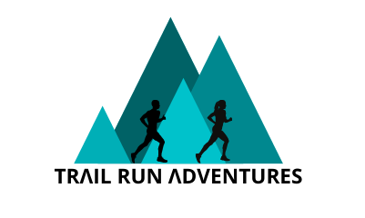

# TRΛIL RUN ΛDVENTURES

<h2 align="center"></h2>

*Developed and designed as part of Milestone Project 4: Full Stack Frameworks
with Django*

[Please view the live project here]()

## Table of Contents

  
Click to expand table of contents

1. [Overview](#overview)
2. [User Experience UX](#user-experience-ux)
    - [User Stories](#user-stories)
    - [Strategy](#strategy)
    - [Scope](#scope)
    - [Structure](#structure)
    - [Skeleton](#skeleton)
    - [Design](#design)
    - [Color Scheme](#color-scheme)
    - [Fonts](#fonts)
    - [Imagery](#imagery)
    - [Logo](#logo)
    - [Icons](#icons)
3. [Features](#features)
    - [Existing Features](#existing-features)
    - [Future Implementation](#future-implementation)
4. [Database](#database)
5. [Technologies](#technologies)
6. [Testing](#testing)
7. [Deployment](#deployment)
    - [GitHub pages](#github-pages)
    - [Forking the Repository](#forking-the-repository)
    - [Local Deployment](#local-deployment)
8. [Credits](#credits)
    - [Code](#code)
    - [Media](#media)
    - [Content](#content)
9. [Acknowledgements](#acknowledgements)
10. [Disclaimer](#disclaimer)

# Overview

The project was created as a **Milestone Project 4** as a part of **Diploma in Full Stack Software Development** with **Code Institute**. The project is developed using Django, a high-level Python web framework, JavaScript, HTML, CSS, and Bootstrap framework.

**TRΛIL RUN ΛDVENTURES** is a multi-page eCommerce web application for trail running enthusiasts and everyone who enjoys being outdoors.

Trail running is simply defined as going for a run at the heart of nature. It's an extremely all-round non-stadia sport that and you don't need to be high in the mountains to go trail running. You simply need to be in nature.

**Please note, this project is for educational purposes only and provided information is fictional. Nevertheless, all the website functionalities work.**

Test transaction details:

credit card: 4242 4242 4242 4242  
expiration date: 04 / 24  
CVC: 424  
ZIP: 42424  

# User Experience (UX)

## User Stories

### Visitor Stories

## Strategy
### Project Goals

### Features and Django Apps

TRΛIL RUN ΛDVENTURES consists of 8 Django applications listed below. 
As explained in Django's documentation - a Django application describes a Python package that provides some set of features. Applications may be reused in various projects.

* `home`
* `about`
* `contact`
* `blog`
* `products`
* `cart`
* `checkout`
* `profiles`

## Technologies
## Languages

- [HTML5](https://en.wikipedia.org/wiki/HTML5) was used to complete the structure of the website.
- [CSS3](https://en.wikipedia.org/wiki/CSS) was used to style the website.
- [Python](https://www.python.org/) was used was used for the backend of the website.
- [JavaScript](https://en.wikipedia.org/wiki/JavaScript) was used to make webpage interactive.

## Frameworks, Libraries and Programs

- [Bootstrap v.5.1](https://getbootstrap.com/docs/5.1/getting-started/introduction/) was used to aid in responsive, mobile-first website design. I used Bootstrap to create grid layouts, navbar, cards, forms, buttons and other features.
- [SQLite](https://www.sqlite.org/index.html) Django built-in database as a database in development mode.
- [PostgreSQL](https://landing.aiven.io/en/aiven-for-postgresql/) (Heroku built-in) as a database in production mode.
- [Django](https://www.djangoproject.com/) 
- [Stripe](https://stripe.com/)
- [AWS](https://aws.amazon.com/) (Amazon Web Services) for hosting static files and images for the website
- [jQuery](https://jquery.com/) was used to simplify DOM manipulation.
- [Figma](https://www.figma.com/) was used to create the wireframes for the website.
- [Font Awesome](https://fontawesome.com/) icons were used throughout the website for better user experience.
- [Google Fonts](https://fonts.google.com/) was used to import the fonts to the website.
- [Favicon](https://favicon.io/favicon-converter/) was used to create the favicon for the website.
- [CSS Tricks](https://css-tricks.com/) was used as a general source.
- [W3School](https://www.w3schools.com/) was used as a general source.
- [Stackoverflow](https://stackoverflow.com/) was used as a general source.
- [GitHub](https://github.com/) was used for repository hosting and for storing the source code.
- [Gitpod](https://gitpod.io/) was used as the development environment for writing the code.
- [Git](https://git-scm.com/) was used as version control system to add, commit and push code to GitHub.
- [Adobe Photoshop Express](https://photoshop.adobe.com/) was used for resizing and cropping the images used on the website.
- [TinyJPG](https://tinyjpg.com/) was used for compressing images while preserving transparency.
- [Techsini](http://techsini.com/multi-mockup/index.php) was used to create the responsive mockup image.
- [Paint 3D](https://www.microsoft.com/en-us/p/paint-3d/9nblggh5fv99?activetab=pivot:overviewtab) was used to modifiy couple of images.
- [Coolors](https://coolors.co/) was used for colour palette used on the website.
- [CSS Autoprefixer](https://autoprefixer.github.io/) was used for adding CSS vendor prefixes.
- [Google Chrome Developer Tools](https://developers.google.com/web/tools/chrome-devtools) was used to test and debug the code.
- [Animate On Scroll Library](https://michalsnik.github.io/aos/) was used to integrate animate on scroll effect on home page.
- [Randomkeygen](https://randomkeygen.com/) was used to generate random passwords and keys.
- [Canva](https://www.canva.com/) was used to design and create the brand logo and favicon

# Testing

Testing process was written in a separate file. 
Please click [here](TESTING.md) for the testing process.

## Version Control

[Git](https://git-scm.com/) as a local repository and [GitHub](https://github.com/) as a remote repository were used for this project. Detailed elaboration please find below:

1. Create a remote repository in GitHub by clicking **"New repository"** on the main page 

2. Use **Code Institute Template**, put the repository name and click Create Repository making sure to select public 

3. Open the repository with [Gitpod](https://www.gitpod.io/). By using Code Institue Template, initialisation including initial commit is done so no need to do `git init` command when open IDE, or to use `git push -u origin main` command for my first commit. `gitignore` file, which is very important for the project including some confidential information, is created with Code Institute template so not necessary to create it. 

