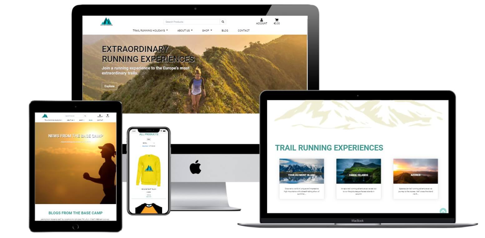
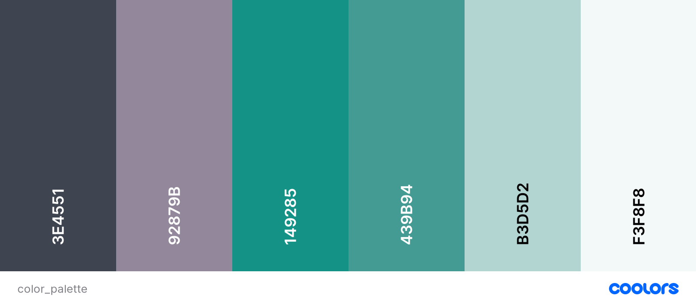
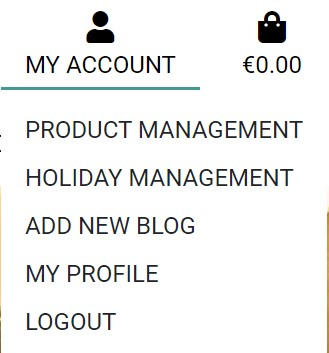
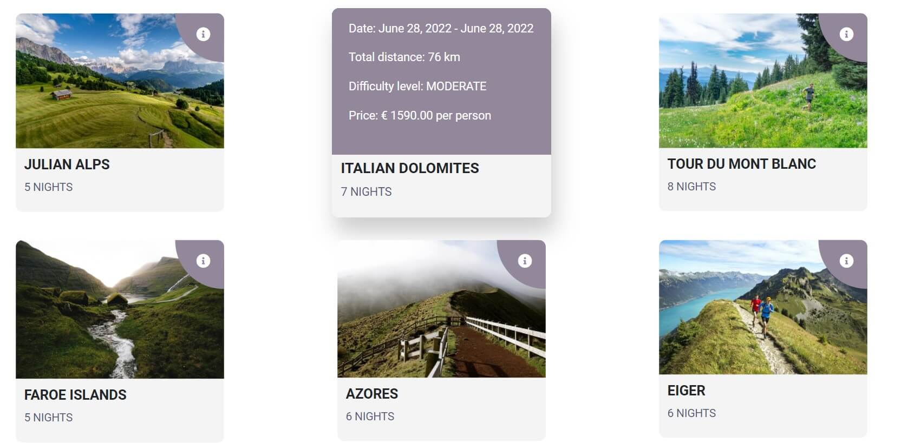
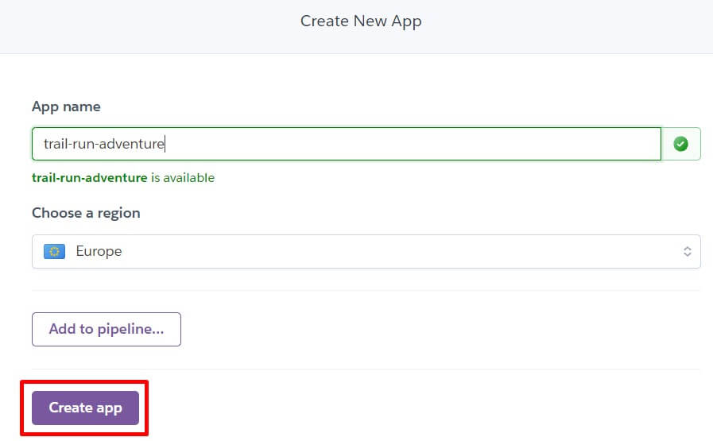
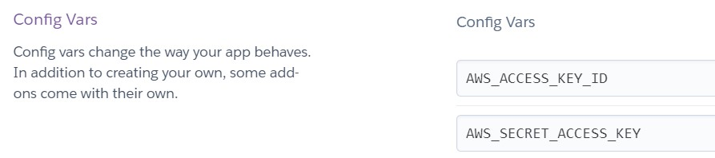

# TRΛIL RUN ΛDVENTURES

<h2 align="center"></h2>

*Developed and designed as part of Milestone Project 4: Full Stack Frameworks
with Django*

**[Please view the live project here](https://trail-run-adventures.herokuapp.com/)**

## Table of Contents

<details>

  <summary>Click to expand table of contents</summary>

1. [Overview](#overview)
2. [User Experience UX](#user-experience-ux)
    - [Strategy](#strategy)
        - [Project Goals](#project-goals)
        - [User Stories](#user-stories)
    - [Scope](#scope)
    - [Structure](#structure)
    - [Skeleton](#skeleton)
    - [Design](#design)
        - [Color Scheme](#color-scheme)
        - [Fonts](#fonts)
        - [Imagery](#imagery)
3. [Features](#features)
    - [Existing Features](#existing-features)
    - [Future Implementation](#future-implementation)
4. [Django Apps](#django-apps)
    - [Database](#database)
    - [Apps and Data Models](#apps-and-data-models)
5. [Technologies](#technologies)
6. [Testing](#testing)
7. [Version Control](#version-control)
8. [Deployment](#deployment)
    - [GitHub pages](#github-pages)
    - [Forking the Repository](#forking-the-repository)
    - [Local Deployment](#local-deployment)
9. [Credits](#credits)
10. [Acknowledgements](#acknowledgements)
11. [Disclaimer](#disclaimer)

</details>

# Overview

The project was created as a **Milestone Project 4** as a part of **Diploma in Full Stack Software Development** with **Code Institute**. The project is developed using Django, a high-level Python web framework, JavaScript, HTML, CSS, and Bootstrap framework.

**TRΛIL RUN ΛDVENTURES** is a multi-page eCommerce web application for trail running enthusiasts and everyone who enjoys being outdoors. The website offers the users to buy trail running adventure holidays and custom branded products. 

The project was conceptualized to give unique travel experiences whilst running spectacular trails to unique and jaw-dropping destinations around Europe. 

Trail running is simply defined as going for a run at the heart of nature. It's an extremely all-round non-stadia sport and you don't need to be high in the mountains to go trail running. You simply need to be in nature.

<h2 align="center"></h2>

Mockup responsive image was created with [Techsini](https://techsini.com/).

**Please note, this project is for educational purposes only and provided information is fictional. Nevertheless, all the website functionalities work.**

Test credit card details:

credit card: 4242 4242 4242 4242 <br>
expiration date: 04 / 24 <br>
CVC: 424 <br>
ZIP: 42424 <br>

*For the assessor, I have included the admin login details in the comments section when submitting the project.*

# User Experience (UX)

## Strategy
### Project Goals

**Users**
- To navigate the website easily and understand its purpose.
- Get useful information about holiday adventures and offered branded products to purchase.
- Purchase selected trail running holidays or/and products easily and securely.
- Contact website owner to get more information about holiday adventures if needed.
- Get information about the company and its team.
- To read insightful blog posts and leave a comment.
- To be able to create account and update my personal information.
- To see a history of my previous purchases.

**Site Owner**
- Engage people to do outdoor activities.
- Motivate people to try trail running, hiking, and outdoor adventures in general.
- Let people know about TRΛIL RUN ΛDVENTURES.
- To be able to create/update/delete products and their information as an admin user.
- Provide a fully secure, easy to use and engaging eCommerce platform to purchase trail running holidays and branded products.
- Attractive and good quality UI design.
- Opportunity to scale the business easily and earn profits.

## User Stories

|      As a/an...      |                         I want the ability to...                         | So that...|
|:--------------------:|:------------------------------------------------------------------------:|:---------:|
|                      |                                                                          |
|                      |                                                                          |           |
| Potential customer   | gain understanding of the website's purpose from the home page           | I can decide will I continue browsing the site.              |                                                                            
| Potential customer   | easily navigate through the site on all devices                          | I can find what I am looking for with an ease.               |
| Potential customer   | create an account easily                                                 | I can purchase products.   |
| Potential customer   | search for shop products by the name                                          | I can find what I am looking for.                   |
| Potential customer   | view product details                                                     | I can decide will I make the purchase.              |
| Potential customer   | read insightful blog posts                                               | I can get an opportunity to learn something new.         |
|          ---         |                                    ---                                   |                         --                 |
| Shopper user         | view products by categories                                              | I know where to search when I look for a specific product.                |
| Shopper user         | get purchase confirmation                                                | I can ensure the purchase was confirmed.             |
| Shopper user         | register on the site                                                     | I can create my personal account.               |
| Shopper user         | to easily view the shopping cart at any time                             | I can easily proceed to the checkout page.                 |
| Shopper user         | to view items I have added to my shopping cart                           | I can identify the subtotals and the total cost of my purchase.                   |
| Shopper user         | to be able to adjust quantity of a particular item in the shopping cart  | I can make changes before the checkout.              |
| Shopper user         | go through an ordering process in a simple way                          | I can have a great UX.              |
|          ---         |                                    ---                                   |                              --                 |
| Site admin/superuser | add new products easily                                                         | new products can be added to sell               |
| Site admin/superuser | edit and update products                                                 | products are up to date in terms of price, description, etc.                   |
| Site admin/superuser | delete products                                                          | products can be removed from the site in case out of stock or not available anymore.            |
| Site admin/superuser | create blog posts                                                        | the website users are informed on interesting stories from the base camp.     |
| Site admin/superuser | delete blog posts                                                        | the blog post is removed in case it becomes outdated. |

## Scope

The website will be created as a desktop-first because it will be much easier to conceptualize the whole structure of the website; however, it will be a fully mobile responsive website so the users using mobile devices will have no difficulties searching for the information they are interested, and to purchase branded products and trail running holidays. Many features will be available that allow the user to engage and find needed information fast and easy.

The site will consist of the homepage which will give an overview of the site purpose with a search feature, brief company information, trail running experience holiday tours, shop section, a blog section and customer quotes section.

Furthermore, the website will contain Trail Running Holidays page with all information the users might need for each trail running adventure the company currently offers. Also, the website will contain About Us page with sub-pages Our Story and Our Team, Shop, Blog and Contact pages.

## Structure

Below is the website page structure to show the core relationships between the pages.

<h2 align="center"></h2>

I've used [Lucidchart](https://www.lucidchart.com/) to draw Page Structure

## Skeleton
The wireframes were created in [Figma](https://www.figma.com/)

Wireframes created at the start of the project for desktop and mobile can be viewed on the below links:

Desktop Wireframes | Mobile Wireframes
------------------ | ----------------
[Homepage](readme-files/wireframes/desktop_homepage.jpg) | [Homepage]()
[Trail Running Holidays](readme-files/wireframes/.jpg) | [Trail Running Holidays]() - TBA
[Trail Running Holidays - detail](readme-files/wireframes/desktop_holiday_detail.jpg) | [Trail Running Holidays]()    
[Our Story](readme-files/wireframes/desktop_about_our_story.jpg) | [Our Story]()
[Our Team](readme-files/wireframes/desktop_our_team.jpg) | [Our Team]()
[Shop](readme-files/wireframes/desktop_shop_all_products.jpg) | [Shop]()
[Shop - product detail](readme-files/wireframes/product_detail.jpg) | [Shop - product detail]()
[Shopping Cart](readme-files/wireframes/desktop_cart.jpg) | [Shopping Cart]()
[Checkout]() | [Checkout]() - TBA
[Blog](readme-files/wireframes/desktop_blog.jpg) | [Blog]()
[Blog Post](readme-files/wireframes/desktop_blog_post.jpg) | [Blog Post]()
[Contact](readme-files/wireframes/desktop_contact.jpg) | [Contact]()
[Profile]() | [Profile]() - TBA
[Log In](readme-files/wireframes/desktop_login.jpg) | [Log In]()
[Register](readme-files/wireframes/desktop_register.jpg) | [Register]()

## Design
### Color Scheme

Delicate and soothing color palette will be chosen and the balance with calmer, contemporary mood for the audience will be tried to get achieved. Below colors will be used for the website:

- Cultured (#F3F8F8)
- Opal (#B3D5D2)
- Polished Pine (#439B94) 
- Illuminating Emarald (#149285)
- Heliotrope Gray (#92879B)
- Charcoal (#3E4551)

<h2 align="center"></h2>

[Coolors](https://coolors.co/) was used to create a color palette.

Shades of green color in particular Polished Pine color (#439B94) will be selected as primary color because it is the color of nature and health. Green is a perfect choice for outdoor brand and eco-friendliness and sustainability that TRΛIL RUN ΛDVENTURES promotes. 

White will be primarily used as the background color because it represents reverence, purity, and innocence. This association calms people and influences their brain activity in a very positive way.

Charcoal (#3E4551) will be used only for footer section and it combines great with the green colors on the website.

## Fonts

- Two fonts will be used throughout the project, **Roboto** and **Lato**. Both will be used with ``sans-serif`` font as a fallback.
**Roboto** will be used for the main headings and paragraph sections and **Roboto** will be used for the subheadings.

- These fonts pair very well together and make the website appear both prestigious and contemporary. This font combination looks elegant and highly readable.

- Fonts were imported from [Google Fonts](https://fonts.google.com/).

## Imagery
### Logo

- I used [Canva](https://www.canva.com/) to design the custom website logo and favicon. 

### Icons

Icons should be obvious and very intuitive so that users can easily understand what a particular icon represents.

# Features
## Existing Features

- Navbar
    - responsive on all devices
    - the logo is in the top left corner on large devices (desktop) and in the center on the smaller devices (tablets and mobile phones). When logo is clicked it redirects a user to the home page. On smaller devices (tablet, mobile) the navbar is collapsed into a hamburger menu.
    - a search box is a part of the top navigation located at upper center of navbar where a user can search for products. On mobile and tablet devices it is located under the hamburger menu.
    - navbar also contains my account and cart icons. The cart icon with grand total will be displayed if there are items added to the cart. It changes colour to the green when a product is added to the cart to catch the user's attention. Clicking the cart icon redirects a user to the shopping cart page.
    - the difference in My Account display is for a regular user and for admin (super user).<br>
    

    For **Admin user** (superuser) it contains Product Management, Holiday Management, Add New Blog, My Profile, and Logout links. Under the Product Management page, the admin can add new products and under the Holiday Management holiday adventures can be added. <br>

    <h2 align="center"></h2>

    For a **Regular user** it contains My Profile, Logout and Order History (only if order was placed) links. <br>

    <h2 align="center"></h2>

- Search Functionality
    - as previously mentioned, a search box is part of the top navigation and is, therefore, accessible on all pages.
    - it is collapsed under the hamburger menu on tablet and mobile devices as shown in the image below.
    - it allows customers to enter keywords associated with the shop products they wish to purchase. 
    - the search results show the number of products found for the search query, as well as inform the user if no products were found.
    
    <br>

    <h2 align="center"></h2>

- Footer
    - the footer is standard across all pages on the website.
    - it contains fast access links, contact details and social media. There is also a copyright information.
    
    <br>

    <h2 align="center"></h2>


- Home App
    - The main purpose of the home page is to allure new users to the website, give a clear understanding of the business and to capture their interest by using the website's functionalities. Smooth animation on scroll is applied throughout the pages. The home page consists of 7 sections.

        - **Hero image** contains a full-screen background image, main heading with a sub-heading and "Explore" button that redirects a user to the Trail running holidays page. The purpose of the effective hero image is used to gain instant user attention and to call to an action.

        </br>

        <h2 align="center"></h2>

        - **Introduction** section contains an introduction about the company, what it offers and what can be explored on the website. It contains a heading, a paragraph section and "Find out more" button which redirects to Our Story page. Also, a mountain range image is placed as a background in order to grab users attention.

        </br>

        <h2 align="center"></h2>

        - **Trail Running Holidays** section displays three trail running holiday tour cards. Holiday tour cards consist of animated on hover image with tour title, and a card content section. On the bottom section part, a button "Explore more" is located that redirects to the Trail Running Holidays page.

        </br>

        <h2 align="center"></h2>

        - **Shop products** section displays three product categories (Shirts, Accessories, and Drinkware) along with a button "Shop All" which redirects to the Products page.

        </br>

        <h2 align="center"></h2>

        - **Benefits** section provides information to the user about some of the advantages of the company and why to do the business with us. Three cards with animation were strategically placed. When the user hovers over each image, additional text with animation will appear. Also, when the user clicks on each image it redirects the user to Our Story page.

        </br>

        <h2 align="center"></h2>

        - **Blog** section (News from Basecamp) contains two blog post with an image and a blog content. At the bottom a 'comment' icon is located which indicates are there any comments added to a particular blog post.

        </br>

        <h2 align="center"></h2>

        - **Customer Reviews** section contains the customer's reviews carousel. This section is static, but it is planned to implement a dynamic showcase of user's reviews.

        </br>

        <h2 align="center"></h2>

- About Us
    - About Us consists of two pages **Our Story** and **Our Team**. Our Story page provider an information to the user about the focus of the website, the company, purpose, and benefits booking a tour or make a purchase on the website shop. Our Team page gives a short introduction to TRΛIL RUN ΛDVENTURES Team with an image and short bio of each team member.

        </br>

        <h2 align="center"></h2>

- Blog App
    - this page mostly relies on textual content with images and can be divided into 3 parts - basecamp blog, blogs posts and admin blog management activities.
        - **basecampblog** displays short introductions to all available blog posts and links to them.
        - **blog posts** are individual blog entries, each addressing a topic related to trail running, outdoors, sustainability, and similar subjects.
        - **admin blog management** includes adding, editing, and deleting blog posts. Users with admin rights have permission to do that directly in the UI through forms. In case of deleting a blog post, a modal will open to check if the user really wants to proceed with this action.

- Contact App
    - contact page consists of 2 sections:
        - *Contact form* where users can reach the company by inputting their details (full name, email) and write a subject and a message inquiry. The email will be sent to the website admin.
        - *Company contact details* provides an information about the working hours and telephone number.

        </br>

        <h2 align="center"></h2>

        </br>

        <h2 align="center"></h2>

- Products App
    - products app consists of 2 pages:
        - **Trail Running Holidays** page consits of a list holidays where all holidays are visible to the user organized in six cards. Cards consist of image and footer section with holiday title and duration info. When the user hovers over the info icon locate in left top corner the overlay appears with addition tour information.

    </br>

    <h2 align="center"></h2>

    - **Shop** page located under the 'Shop' tab contains all branded products the user can purchase. Products are categoriezed in 3 categories: Shirts, Drinkware and Accessories.

- Cart App
    - cart is a standard eCommerce functionality which aids the checkout process. A cart icon is displayed in the top right website's corner. 
    - The cart icon with the grand total will be displayed if there are items added to the cart. The cart icon changes the color to green when a product is added to the cart to catch the user's attention. 
    - After clicking on the cart icon, the user gets an overview of all the products put into the cart. The user can also modify the quantity of the added products as well as remove the products from the cart. 
    - all the products in the cart are also linked to their product details page so that the user has an easy access to each item in case they wish to check it again before proceeding with the checkout process.
    - if the user tries to access their empty cart, a message gets displayed that nothing has been added yet and encourage them to go to the shop.

- Checkout App
    - Once the user is happy with their cart they can proceed to the checkout page.
    - On the checkout page the checkout form and a list of their cart items with the the total amount is displayed.

    - Order confirmation page
        - Once the order has been confirmed the user is then directed to the order confirmation page.
        - The user is then shown the order details and the order number.
        - A confirmation email will also be sent to the user.

        </br>

        <h2 align="center"></h2>

        *Email confirmation*
        <h2 align="center"></h2>

- Toasts
    - alert messages to site visitors divided into 4 categories: `toast_success`, `toast_info`, `toast_warning`, and `toast_error`
    - toasts appear on every page whenever a certain action has been done by the user.
    - their purpose is to give feedback on the action a user has just performed, such as logging in, logging out, adding a product to the cart, etc.

- Django allauth
    - `django-allauth` is a Python package. According to the [django-allauth](https://django-allauth.readthedocs.io/en/latest/) docs, it is an "integrated set of Django applications addressing authentication, registration, account management as well as 3rd party (social) account authentication."
    - it provides a set of features such as signup, login, logout, and password change
    - after register, a verification e-mail is sent to the registered e-mail to confirm it. Once confirmed, the user can log in with their credentials and access the profile

    - Register
        - If the user isn't register she/he can click the register link and be redirected to the register page.
        - Here the user can fill in the register form to signup.
        - The page also has a link to the login in case user has navigated here but has already been registered.

        </br>

        <h2 align="center"></h2>

    - Login

        - Once the user has been registered she/he can use the login feature.
        - The users can fill out their login details.
        - There is a link to the regiser page in case a user has navigated here by mistake.
        - There is also a link to reset the password.

        </br>

        <h2 align="center"></h2>

- Interactive
    - back to top arrow button will appear on the lower right of the page when the user starts to scroll down the page
    - animate on scroll library (AOS)

- Social media
    - social media icons will be located in the footer section
    - allow users to find more information on TRΛIL RUN ΛDVENTURES on the social media

- Responsiveness
    - the website is fully responsive on all devices

- 404 and 500 error pages
    - if a user navigates to a page which does not exist or if they do not have permission to access, they will be directed to a 404 error page
    - if there is an internal problems with the server, a 500 error page will appear

## Future Implementation

- Wishlist
    - a feature that allows authenticated users to save (wishlist) items for later purchase.
- Product reviews
    - the idea would be to implement ratings and product reviews on product and holiday pages.
- Pagination
- Real time chat

# Django Apps

TRΛIL RUN ΛDVENTURES consists of 8 Django applications listed below. 
As explained in Django's documentation - a Django application describes a Python package that provides some set of features. Applications may be reused in various projects.

* `about`
* `contact`
* `home`
* `blog`
* `products`
* `cart`
* `checkout`
* `profiles`

## Database

During the development phase I worked with sqlite3 database which is installed with Django. For deployment(production), a PostgreSQL database is provided by Heroku as an add-on.

## Apps and Data Models

### **About app**

**INSTRUCTOR**
- Stores information about adventure holidays 

### **Blog app**

**BLOG POST**
- Stores information about the Blog posts.

**COMMENT**
- Stores information used in the Comment Form. It uses Django's auth's User model as a Foreign Key to allow only Registered users to post comments.

### **Checkout app**

**ORDER**
- Stores information about each placed order.

**ORDER LINE ITEM**
- Stores information from the order, used in the calculation in Order model. 

### **Products app**

**CATEGORY**
- Stores information about the product categories.

**LEVEL**
- Stores information about holiday products difficulty levels.

**ITINERARY**
- Stores information about holiday product itinerary

**ITINERARY DAY**
- Stores information about holiday product itinerary data, classified into days.

**PRODUCT MODEL**
- Stores product information, both shop products and holiday products.

**FAQ**
- Stores information about holiday products frequently asked questions.

### **Profiles app**

**USER PROFILE**
- Stores information about registered users and order history.

### Model Relationship Data Schema

I've used [DBDiagram](https://dbdiagram.io/home) to draw up a Database Schema.

<h2 align="center"></h2>

## Technologies
## Languages

- [HTML5](https://en.wikipedia.org/wiki/HTML5) was used to complete the structure of the website.
- [CSS3](https://en.wikipedia.org/wiki/CSS) was used to style the website.
- [Python](https://www.python.org/) was used was used for the backend of the website.
- [JavaScript](https://en.wikipedia.org/wiki/JavaScript) was used to make webpage interactive.

## Frameworks, Libraries and Programs

- [Bootstrap v.5.1](https://getbootstrap.com/docs/5.1/getting-started/introduction/) was used to aid in responsive, mobile-first website design. I used Bootstrap to create grid layouts, navbar, cards, forms, buttons and other features.
- [SQLite](https://www.sqlite.org/index.html) Django built-in database as a database in development mode.
- [PostgreSQL](https://landing.aiven.io/en/aiven-for-postgresql/) (Heroku built-in) as a database in production mode.
- [Django](https://www.djangoproject.com/) is a high-level Python web framework that encourages rapid development and clean, pragmatic design.
- [Stripe](https://stripe.com/) has been used for the payment function of the e-commerce shop.
- [AWS](https://aws.amazon.com/) (Amazon Web Services) for hosting static files and images for the website
- [jQuery](https://jquery.com/) was used to simplify DOM manipulation.
- [Figma](https://www.figma.com/) was used to create the wireframes for the website.
- [Font Awesome](https://fontawesome.com/) icons were used throughout the website for better user experience.
- [Google Fonts](https://fonts.google.com/) was used to import the fonts to the website.
- [Favicon](https://favicon.io/favicon-converter/) was used to create the favicon for the website.
- [CSS Tricks](https://css-tricks.com/) was used as a general source.
- [W3School](https://www.w3schools.com/) was used as a general source.
- [Stackoverflow](https://stackoverflow.com/) was used as a general source.
- [GitHub](https://github.com/) was used for repository hosting and for storing the source code.
- [Gitpod](https://gitpod.io/) was used as the development environment for writing the code.
- [Git](https://git-scm.com/) was used as version control system to add, commit and push code to GitHub.
- [Adobe Photoshop Express](https://photoshop.adobe.com/) was used for resizing and cropping the images used on the website.
- [TinyJPG](https://tinyjpg.com/) was used for compressing images while preserving transparency.
- [Techsini](http://techsini.com/multi-mockup/index.php) was used to create the responsive mockup image.
- [Paint 3D](https://www.microsoft.com/en-us/p/paint-3d/9nblggh5fv99?activetab=pivot:overviewtab) was used to modifiy and crop images.
- [Coolors](https://coolors.co/) was used for color palette used on the website.
- [CSS Autoprefixer](https://autoprefixer.github.io/) was used for adding CSS vendor prefixes.
- [Google Chrome Developer Tools](https://developers.google.com/web/tools/chrome-devtools) was used to test and debug the code.
- [Animate On Scroll Library](https://michalsnik.github.io/aos/) was used to integrate animate on scroll effect on home page.
- [Randomkeygen](https://randomkeygen.com/) was used to generate random passwords and keys.
- [Canva](https://www.canva.com/) was used to design and create the brand logo and favicon
- [Dbdiagram](https://dbdiagram.io/) was used to make a diagram of my database schema.

# Testing

Testing process was written in a separate file. 
[Please click here for the testing process](TESTING.md) .

# Version Control

[Git](https://git-scm.com/) as a local repository and [GitHub](https://github.com/) as a remote repository were used for this project. Detailed elaboration please find below:

1. Create a remote repository in GitHub by clicking **"New"** green button or **"New repository"** on the main page.<br>

<h2 align="center"></h2>

2. Use **Code Institute Template**, put the repository name and click Create Repository making sure to select public.<br>

<h2 align="center"></h2>

3. Open the repository with [Gitpod](https://www.gitpod.io/). By using Code Institute Template, initialization including initial commit is done. `gitignore` file, which is very important for the project including some confidential information, is created with Code Institute template so not necessary to create it.<br>

<h2 align="center"></h2>

**Commits**
- When a section or even a group of work is completed, it is committed in git and pushed into GitHub to make sure to keep the history of the work logged properly. Below commands are used for this:

```
git status = to check the status of new/modified folders, files, and documents
git add . = to put all new and updated work on the stage in git
git add <specific file> = used when different types of work are done but do not want to commit everything on the same commitment
git commit -m "Example commit" = commit the work on the stage in git before pushing it to GitHub
git push = update the repository in GitHub for main / master branch
```

# Deployment
The master branch of this repository is the most current version and has been used for the deployed version of the site. Separate branches were used for implementing features and fixes.

TRΛIL RUN ΛDVENTURES project is hosted on the [Heroku](https://www.heroku.com/) platform with static files and user-uploaded images being hosted on [AWS S3 Basket](https://aws.amazon.com/). Heroku Postgres is used for the database. 

## Local Deployment

To run this project locally make sure you have the following:

- an IDE of your choice (such as Gitpod)
- have the following installed:
    - [Git](https://git-scm.com/)
    - [Python3](https://www.python.org/downloads/)
    - [PIP](https://pypi.org/project/pip/)

### Clone the GitHub Repository

To clone this project and run locally please follow the below steps:
1. Login into GitHub with your account
2. Go to the [project repository](https://github.com/FruitbatM/trail-run-adventures)
3. Click on the "Code" button (located next to the green "Gitpod" button)

<h2 align="center"></h2>

4. From the dropdown menu copy the HTTPS URL
5. In your local IDE open the terminal
6. Change your working directory to the location where you want the cloned project saved
7. Type `git clone` and paste copied URL from Step 4
8. Press enter to create your local clone

### **HEROKU**

Below is the process of deploying the website to Heroku and setting up static files & images in AWS.

1. Crate a new app in Heroku. Click on **New** --> **Create new app**

<h2 align="center"></h2>

2. Then put the App name and select the region. Finally click 'Create app' button to create a new app.

<h2 align="center"></h2>

3. Add Heroku Postgres for the database

<h2 align="center"></h2>

4. Install `dj_database_url` and `psycopg2-binary` to use Heroku Postgres, and run `pip3 freeze > requirements.txt` command to add them on requirments.txt.

<h2 align="center"></h2>

<h2 align="center"></h2>

5. Update `settings.py` file located under the project directory trail_run_adventures. Import `dj_database_url`, comment out sqlite databases and add dj databases variable temporary while the database is transferred to Heroku Postgres.

<h2 align="center"></h2>

6. Run `python3 manage.py showmigrations` command to see the status of migrations (currently not migrated). Run `python3 manage.py migrate` command to migrate.

7. Import all products data. Run `python3 manage.py loaddata` command to load the **categories** first, next **levels**, **itinerary**, **itinerary_days**, **faq**  and the **products** the last. The order of loading is important as all the products are associated with categories, levels, itinerary, itinerary days and faq (frequently asked questions). Afterwards import **team** data.

8. Create a superuser with `python3 manage.py createsuperuser` command.

9. Install `gunicorn` which acts as the webserver, and freeze it into requirements file with the command `pip3 freeze > requirements.txt`

10. Create a **Procfile** which specifies the commands that are executed by the app on the startup

<h2 align="center"></h2>

11. Temporary disable collectstatic by setting `heroku config:set DISABLE_COLLECTSTATIC = 1` and host name of Heroku to allowed hosts in `settings.py`

12. Initialise Heroku in git with `heroku: git:remote -a trail-run-adventures` and put git into Heroku with `git push heroku main`

13. Set up the automatic deployment when git is pushed to GitHub. Go to Deployment on [Heroku](https//:heroku.com), search the GitHub repository, connect and click Enable Automatic Deploys.

<h2 align="center"></h2>

14. Generate a new secret key, set it in Heroku and update `settings.py` file. Change the setting of Debug mode that only True in Development mode.

<h2 align="center"></h2>

15. Check the Activity Feed in Heroku to see Build in Progress to confirm automatic deployment is working.

### **AWS (Amazon Web Services)**

1. Open AWS S3 and create a new bucket, which stores the files, by completing the name and the region.

<h2 align="center"></h2>

2. Set up the basic settings. Enable static website hosting so that it gives a new endpoint for accessing from the internet. Put index.html and error.html as default values.

<h2 align="center"></h2>
<h2 align="center"></h2>

3. Set up CORS configuration which is the access between Heroku and AWS S3 Bucket.

<h2 align="center"></h2>

4. Set up a **Bucket Policy**. Generate a policy with AWS policy generator. Add **/*** at the end of Resource to allow access to all resources in the bucket.

<h2 align="center"></h2>

5. Create a user to access the bucket. Go to IAM (Identity and Access Management) and create a group for the user. Then, create a policy by importing pre-built policy.

<h2 align="center"></h2>
<h2 align="center"></h2>

6. Attach the policy to the group

<h2 align="center"></h2>
<h2 align="center"></h2>

7. Create a user and add it to the group. When the user is added to the group, it creates csv file containing Access Key ID and Secret access key which are used to authenticate them from Django app. *It is very important to download the file and save it as you cannot download it again.*

<h2 align="center"></h2>

### **Connecting to DJANGO** 

1. Install two new packages, `pip3 install boto3` and `pip3 install django-storages`, and run `pip3 freeze > requirements.txt` command to add them to the requirments.txt file.

2. Update `settings.py` file to tell Django which bucket it should be communicating with. *It is very important to keep AWS access keys secrets as these can be used to store or move data in the bucket and you will be charged by Amazon for it*

<h2 align="center"></h2>

3. Add AWS keys to Heroku and set USE_AWS = True under the app 'Settings' tab --> 'Config Vars'

<h2 align="center"></h2>
<h2 align="center"></h2>

4. Create `custome_storages.py` to tell Django to use S3 to store static files and upload images when it is in production

<h2 align="center"></h2>

5. Add `AWS_S3_CUSTOM_DOMAIN = f'{AWS_STORAGE_BUCKET_NAME}.s3.amazonaws.com'` to tell Django where the static files come from in production and add some settings for Static and Media files to settings.py file.

<h2 align="center"></h2>

6. Add all the updates in git, commit it and push it to GitHub. Heroku runs `python3 manage.py` to collectstatic during the process which also searches through all the apps and project folders looking for static files. Then, it uses S3 domain settings in conjunction with the custom storage classes that tell the location at the URL where the things should be saved when it is in production. This can be checked in S3 bucket.

<h2 align="center"></h2>

7. Add Cache control to `settings.py` as static files do not change often and to improve the performance for users.

<h2 align="center"></h2>

8. Upload product images via S3. Create a folder, and upload images.

<h2 align="center"></h2>

9. Verify a superuser's email address on Heroku Postgres. Login admin and check the VERIFIED and PRIMARY boxes

<h2 align="center"></h2>

10. Add Stripe keys to Heroku Config Vars and create a new webhook endpoint.

<h2 align="center"></h2>

<h2 align="center"></h2>

11. Create Gmail account, add email host pass & user to Heroku Config Vars and add code to `settings.py` file.

<h2 align="center"></h2>
<h2 align="center"></h2>

# Credits

Credits were listed in a separate file. Please click here to view [CREDITS.md](CREDITS.md) file.

# Acknowledgements

- My mentor, Mr. Spencer Barriball, for the helpful feedback and guidance.
- [Code Institute](https://codeinstitute.net/) for all course materials and ongoing support.
- Fellow Code Institute students for their feedback and suggestions.
- My family and friends for testing and useful feedback.

# Disclaimer

The information provided on this website is for educational purposes only.

# Support

For any issue resolution or assistance, please email  Marina Pavlovic at mar.pavlovic@gmail.com

> [Back to Top](#table-of-contents) 