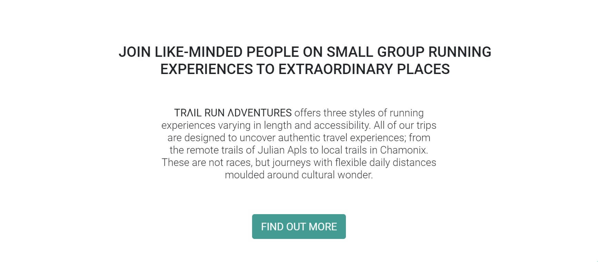
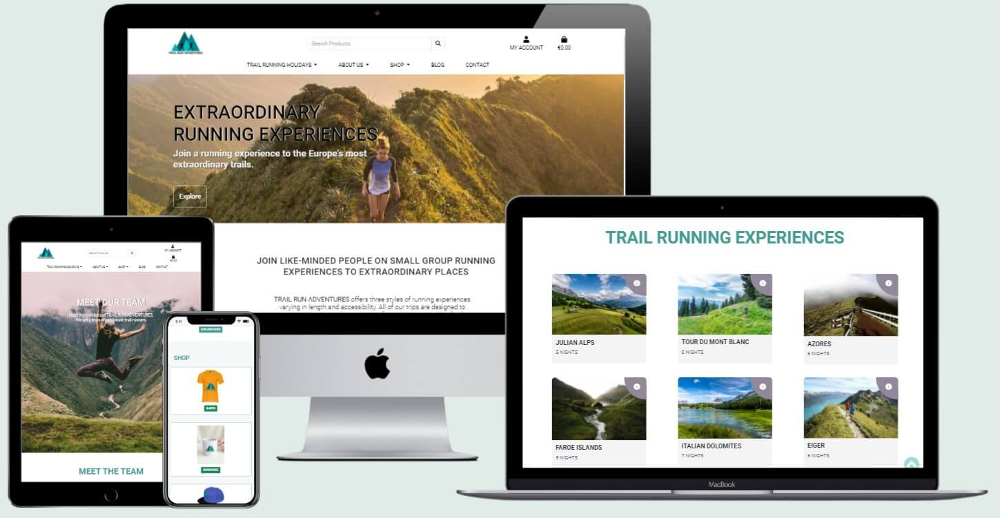
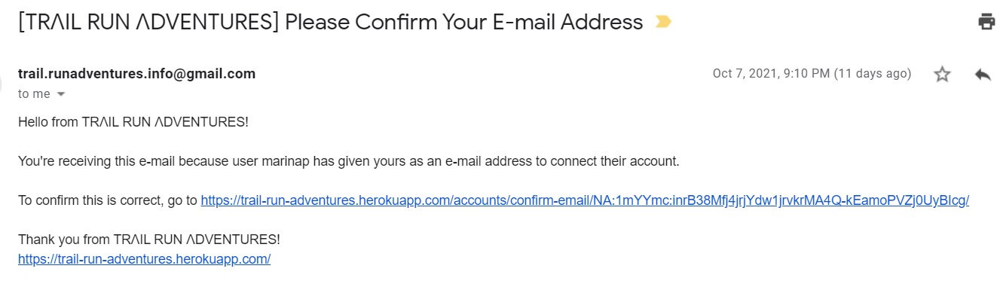
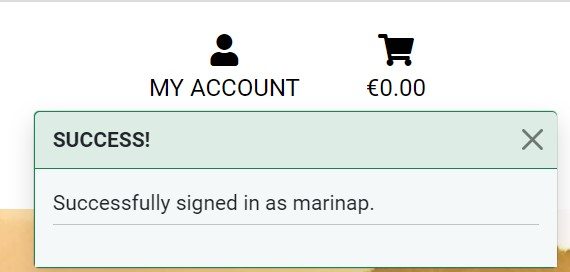
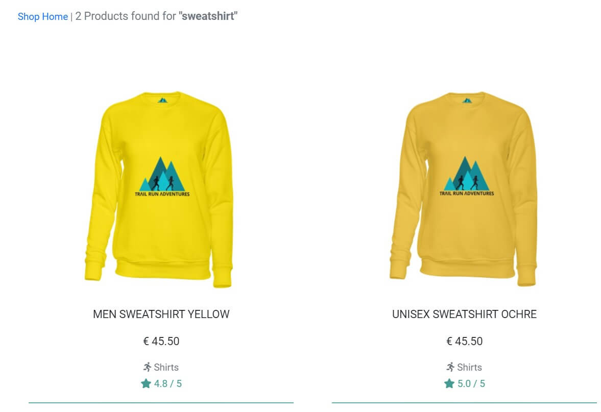
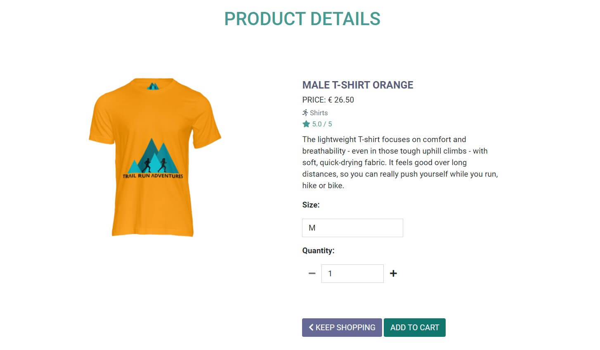

# Testing
## Table of Contents

  
Click to expand table of contents

1. [Testing User Stories](#testing-user-stories)
2. [Code Validation](#code-validation)
3. [Functionality Testing](#functionality-testing)
4. [Encountered Issues](#encountered-issues)
5. [Web Accessibility](#web-accessibility)
6. [Performance Testing](#performance-testing)

# User Stories Testing

Manual tests were carried out across all user stories and features:

## Test Case 1

> As a potential customer I want the ability gain understanding of the website's purpose from the home page so that I can decide will I continue browsing the site.

**Description:**
Verify that the website's purpose is clear when a user navigates to the sites homepage.

**Steps:**
1. Open internet browser of choice.
2. Navigate to [TRΛIL RUN ΛDVENTURES](https://trail-run-adventures.herokuapp.com/).
3. Read the headline and subheadline on the hero image.
3. Strategically placed headline and subheadline indicate to the user what is the website's purpose.
4. Scroll to the content beneath the website's hero image and read the main heading and paragraph.

**Expected Result**
- Strategically placed headline and subheadline on the hero image indicate to the user what is the website's purpose.
- A first section on the home page explains in more detail the website's purpose.

**Actual Result:**
- Strategically placed headline and subheadline on the hero image indicate to the user what is the website's purpose.
- A first section on the home page explains in more detail the website's purpose.

**Pass/Fail:**
Pass

*Image Test 1 A*
  <h2 align="center"></h2>

*Image Test 1 B*
  <h2 align="center"></h2>

## Test Case 2

> As a potential customer I want the ability to easily navigate through the site on all devices so that I can find what I am looking for with an ease.

**Description:**
Verify the website's responsiveness across different device types.

**Steps:**
1. Open internet browser of choice.
2. Navigate to [TRΛIL RUN ΛDVENTURES](https://trail-run-adventures.herokuapp.com/).
3. Test the responsiveness of the website on each available device.
4. Document the results.

**Expected Result**
 The site will be responsive across all available devices.

**Actual Result:**
- The website was primarily tested on the following devices:
    - iPhone 11
    - iPhone 7
    - Samsung Galaxy Tab A
    - Lenovo ThinkBook 13S
    - Monitor 31.5" PHILIPS 322E1C

- Other tests were performed to determine the site's responsiveness using Google Dev Tools in order to view the site on a variety of devices.

**Pass/Fail:**
Pass

  <h2 align="center"></h2>

## Test Case 3

> As a potential customer I want the ability to create an account easily so that I can purchase products.

**Description:**
Verify that the site provides the user with an ability to create an account easily.

**Steps:**
1. Open internet browser of choice.
2. Navigate to [TRΛIL RUN ΛDVENTURES](https://trail-run-adventures.herokuapp.com/).
3. Click on 'My Account' icon in the navigation bar. And click on Register tab.
4. Fill out the registration form.
5. Log in with the credentials that were created when filling out the registration form.

**Expected Result**
When the user clicks on the Register tab, a registration form will get displayed and once successfully completed and submitted the user will receive an email asking her/him to verify their account. Once the user's email has been verified the user will be able to log in with the credentials they have created.

**Actual Result:**
A registration form is displayed and once successfully completed and submitted the user receives the email asking them to verify their account. Once the user's email has been verified they are able to log inwith the credentials they have created.

**Pass/Fail:**
Pass

*Image Test 3 A*
  <h2 align="center"></h2>

*Image Test 3 B*
<h2 align="center"></h2>

## Test Case 4
> As a potential customer I want to have an option to search for products by the name so I can find what I am looking for.

**Description:**
Verify search feature works as expected.

**Steps:**
1. Open internet browser of choice.
2. Navigate to [TRΛIL RUN ΛDVENTURES](https://trail-run-adventures.herokuapp.com/).
3. Locate the search bar located at upper center of navbar on desktop. On mobile and tablet devices it is located under the hamburger menu.
4. Search for 'sweatshirt' to confirm that displayed products have 'sweatshirt' in their name.

**Expected Result**
Only products that contain 'sweatshirt' in their name will get displayed to the user.

**Actual Result:**
Only products that contain 'sweatshirt' in their name will get displayed to the user.

**Pass/Fail:**
Pass

  <h2 align="center"></h2>

## Test Case 5

> As a potential customer I want to view product details so I can decide will I make the purchase.

**Description:**
Verify product detail page works as expected.

**Steps:**
1. Open internet browser of choice.
2. Navigate to [TRΛIL RUN ΛDVENTURES](https://trail-run-adventures.herokuapp.com/).
3. Click on the 'Shop' tab and select (click on) 'MALE T-SHIRT ORANGE'
4. Confirm the product detail page with 'MALE T-SHIRT ORANGE' opens as expected.

**Expected Result**
The product detail page for the selected product gets displayed to the user.

**Actual Result:**
The product detail page for the selected product gets displayed to the user.

**Pass/Fail:**
Pass

  <h2 align="center"></h2>

# Code Validation

- The website was validated by the [W3C Markup Validation Service](https://validator.w3.org/) to ensure there were no syntax errors or issues. 
- [W3C CSS Validation Service](https://jigsaw.w3.org/css-validator/) was used to validate CSS code.
- [JSHint](https://jshint.com/) was used for JavaScript code validation was used for validation of JavaScript.
- [PEP8 Online](http://pep8online.com/) was used for Python PEP8 compliance

## [W3C Markup Validation Service](https://validator.w3.org/) - Markup Validation

### Home Page

### Our Story Page

## [W3C CSS Validation Service](https://jigsaw.w3.org/css-validator/) - CSS Validation
### base.css
