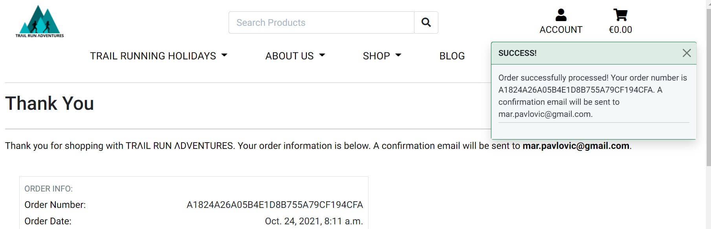
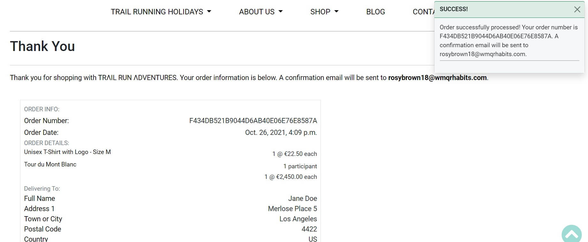
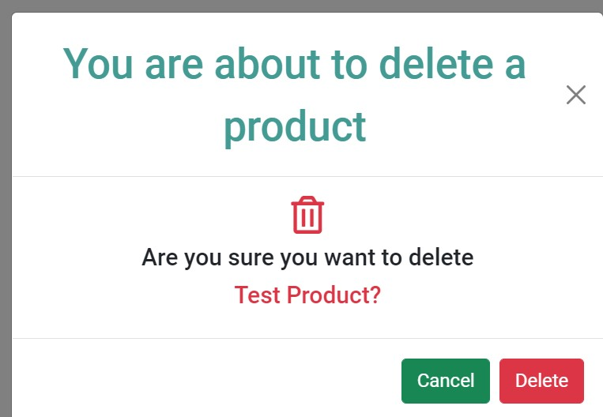

# Testing
## Table of Contents
<details>
  <summary>Click to expand table of contents</summary>

1. [Testing User Stories](#testing-user-stories)
2. [Code Validation](#code-validation)
3. [Functionality Testing](#functionality-testing)
4. [Django Unit Testing](#django-unit-testing)
5. [Defensive Programming and Security](#defensive-programming-and-security)
6. [Manual Testing](#manual-testing)
7. [Encountered Issues](#encountered-issues)
8. [Web Accessibility](#web-accessibility)
9. [Performance Testing](#performance-testing)
</details>

# Testing User Stories

Manual tests were carried out across all user stories and features:

## Test Case 1

> As a potential customer I want the ability gain understanding of the website's purpose from the home page so that I can decide will I continue browsing the site.

**Description:**
Verify that the website's purpose is clear when a user navigates to the websie homepage.

**Steps:**
1. Open internet browser of choice.
2. Navigate to [TRΛIL RUN ΛDVENTURES](https://trail-run-adventures.herokuapp.com/).
3. Read the headline and sub headline on the hero image.
3. Strategically placed headline and sub headline indicate to the user what is the website's purpose.
4. Scroll to the content beneath the website's hero image and read the main heading and paragraph.

**Expected Result**
- Strategically placed headline and sub headline on the hero image indicate to the user what is the website's purpose.
- A first section on the home page explains in more detail the website's purpose.

**Actual Result:**
- Strategically placed headline and sub headline on the hero image indicate to the user what is the website's purpose.
- A first section on the home page explains in more detail the website's purpose.

**Pass/Fail:**
Pass

*Image Test 1 A*
  <h2 align="center"></h2>

*Image Test 1 B*
  <h2 align="center"></h2>


## Test Case 2

> As a potential customer I want the ability to easily navigate through the site on all devices so that I can find what I am looking for with an ease.

**Description:**
Verify the website's responsiveness across different device types.

**Steps:**
1. Open internet browser of choice.
2. Navigate to [TRΛIL RUN ΛDVENTURES](https://trail-run-adventures.herokuapp.com/).
3. Test the responsiveness of the website on each available device.
4. Document the results.

**Expected Result**
 The site will be responsive across all available devices.

**Actual Result:**
- The website was primarily tested on the following devices:
    - iPhone 11
    - iPhone 7
    - Samsung Galaxy Tab A
    - Lenovo ThinkBook 13S
    - Monitor 31.5" PHILIPS 322E1C

- Other tests were performed to determine the site's responsiveness using Google Dev Tools in order to view the site on a variety of devices.

**Pass/Fail:**
Pass

  <h2 align="center"></h2>

## Test Case 3

> As a potential customer I want the ability to create an account easily so that I can purchase products.

**Description:**
Verify that the site provides the user with an ability to create an account easily.

**Steps:**
1. Open internet browser of choice.
2. Navigate to [TRΛIL RUN ΛDVENTURES](https://trail-run-adventures.herokuapp.com/).
3. Click on 'My Account' icon in the navigation bar. And click on Register tab.
4. Fill out the registration form.
5. Log in with the credentials that were created when filling out the registration form.

**Expected Result**
When the user clicks on the Register tab, a registration form will get displayed and once successfully completed and submitted the user will receive an email asking her/him to verify their account. Once the user's email has been verified the user will be able to log in with the credentials they have created.

**Actual Result:**
A registration form is displayed and once successfully completed and submitted the user receives the email asking them to verify their account. Once the user's email has been verified, they are able to log in with the credentials they have created.

**Pass/Fail:**
Pass

*Image Test 3 A*
  <h2 align="center"></h2>

*Image Test 3 B*
<h2 align="center"></h2>

## Test Case 4
> As a potential customer I want the ability to the ability to have an option to search for products by the name so I can find what I am looking for.

**Description:**
Verify search feature works as expected.

**Steps:**
1. Open internet browser of choice.
2. Navigate to [TRΛIL RUN ΛDVENTURES](https://trail-run-adventures.herokuapp.com/).
3. Locate the search bar located at upper center of navbar on desktop. On mobile and tablet devices it is located under the hamburger menu.
4. Search for 'sweatshirt' to confirm that displayed products have 'sweatshirt' in their name.

**Expected Result**
Only products that contain 'sweatshirt' in their name will get displayed to the user.

**Actual Result:**
Only products that contain 'sweatshirt' in their name will get displayed to the user.

**Pass/Fail:**
Pass

  <h2 align="center"></h2>

## Test Case 5

> As a potential customer I want the ability to view product details so I can decide will I make the purchase.

**Description:**
Verify product detail page works as expected.

**Steps:**
1. Open internet browser of choice.
2. Navigate to [TRΛIL RUN ΛDVENTURES](https://trail-run-adventures.herokuapp.com/).
3. Click on the 'Shop' tab and select (click on) 'MALE T-SHIRT ORANGE'
4. Confirm the product detail page with 'MALE T-SHIRT ORANGE' opens as expected.

**Expected Result**
The product detail page for the selected product gets displayed to the user.

**Actual Result:**
The product detail page for the selected product gets displayed to the user.

**Pass/Fail:**
Pass

  <h2 align="center"></h2>

## Test Case 6

> As a potential customer I want the ability to read insightful blog posts so I can get an opportunity to learn something new.

**Description:**
Verify blog and blog post pages works as expected.

**Steps:**
1. Open internet browser of choice.
2. Navigate to [TRΛIL RUN ΛDVENTURES](https://trail-run-adventures.herokuapp.com/).
3. Click on the 'Blog' tab. Click on the blog post of your choice.
4. Confirm the blog page and blog post page open as expected.

**Expected Result**
The blog page and blog post page get displayed to the user.

**Actual Result:**
The blog page and blog post page get displayed to the user.

**Pass/Fail:**
Pass

  <h2 align="center"></h2>
  <h2 align="center"></h2>

## Test Case 7

> As a shopper user I want the ability to view products by categories so I can I know where to search when I look for a specific product.

**Description:**
Verify 

**Steps:**
1. Open internet browser of choice.
2. Navigate to [TRΛIL RUN ΛDVENTURES](https://trail-run-adventures.herokuapp.com/).
3. Click on the 'Shop' tab.
4. Confirm category options are available from the dropdown menu.

**Expected Result**
Shop product categories get displayed to the user.

**Actual Result:**
Shop product categories get displayed to the user.

**Pass/Fail:**
Pass

## Test Case 8
> As a shopper user I want the ability to get purchase confirmation so I can ensure the purchase was confirmed.

**Description:**
Verify that the site provides the user with a confirmation email after a payment.

**Steps:**
1. Open internet browser of choice.
2. Navigate to [TRΛIL RUN ΛDVENTURES](https://trail-run-adventures.herokuapp.com/).
3. Click on the 'Shop' tab and select and select one of the product categories from the drop-down menu
4. Click on the product you wish to purchase.
5. A detail product page will open.
6. Click 'Add to Cart' button beneath the product description.
7. Navigate to the Cart page.
8. Click 'Secure Checkout' button.
9. Fill out the payment form as instructed.
10. If the payment was successful, checkout success page with the order details will appear.
11. The user will receive the confirmation email in the user's email inbox.

**Expected Result**
The site will provide the user with a confirmation email after a payment.

**Actual Result:**
The site provides the user with a confirmation email after a payment.

**Pass/Fail:**
Pass

  <h2 align="center"></h2>

*Email confirmation*
  <h2 align="center"></h2>

## Test Case 9
> As a shopper user I want the ability to register on the site so I can create my personal account.

**Description:**
Verify that the website provides the user with an opportunity to create a personal account.

**Steps:**
1. Open internet browser of choice.
2. Navigate to [TRΛIL RUN ΛDVENTURES](https://trail-run-adventures.herokuapp.com/).
3. Click on the 'My Account' icon located in the top navigation and click on the 'Register' tab. 
4. Fill out the registration form.
5. Verify the email address.
6. Log in with the credentials that the user created when filling out the registration form.

**Expected Result**
A registration form will be displayed and once successfully completed and submitted the user will receive an email asking them to verify their account. Once the user's email has been verified, they will be able to log in easily with the credentials they have created.

**Actual Result:**
A registration form is provided and once successfully completed and submitted the user receives an email asking them to verify their account. Once the user's email has been verified, they are able to log in easily with the credentials they have created.

**Pass/Fail:**
Pass

  <h2 align="center"></h2>

  <h2 align="center"></h2>

  <h2 align="center"></h2>

  <h2 align="center"></h2>

  <h2 align="center"></h2>

## Test Case 10
> As a shopper user I want the ability to easily view the shopping cart at any time so I can easily proceed to the checkout page.

**Description:**
Verify that the shopping cart icon is displayed on all pages and devices so the user can easily proceed to the Cart page.

**Steps:**
1. Open internet browser of choice.
2. Navigate to [TRΛIL RUN ΛDVENTURES](https://trail-run-adventures.herokuapp.com/).
3. Shopping cart icon is located at the top navigation right corner.
4. Once the shopping cart icon is clicked, the Cart page gets opened.

**Expected Result**
Shopping cart icon is displayed on all pages and devices.

**Actual Result:**
Shopping cart icon is displayed on all pages and devices.

**Pass/Fail:**
Pass

## Test Case 11
> As a shopper user I want the ability to view items I have added to my shopping cart at any time so that I can identify the subtotals and the total cost of my purchase.

**Description:**
Verify that the user can see shopping cart on all website pages and on all devices.

**Steps:**
1. Open internet browser of choice.
2. Navigate to [TRΛIL RUN ΛDVENTURES](https://trail-run-adventures.herokuapp.com/).
3. Select at least one product and add it to the cart.
4. Shopping cart icon displayed in the top right corner will update to green color with the cart amount.
5. Clicking the shopping cart icon redirects the user to shopping cart page where correct subtotal and total amounts are displayed.

**Expected Result:**
The shopping cart icon will change the color to green when at least one item was added to the cart. The cart amount will update correctly when each new item will be added to the cart. And once the icon is clicked the user will be redirected to the shopping cart page.

**Actual Result:**
The shopping cart icon changes the color to green when at least one item was added to the cart. The cart amount updates correctly when each new item is added to the cart. And once the icon is clicked the user is redirected to the shopping cart page.

**Pass/Fail:**
Pass

## Test Case 12
> As a shopper user I want the ability to be able to adjust quantity of a particular item in the shopping cart so that I can make changes before the checkout.

**Description:**
Verify that the user can adjust quantity of a particular shop product item as well for holiday tours in the shopping cart.

**Steps:**
1. Open internet browser of choice.
2. Navigate to [TRΛIL RUN ΛDVENTURES](https://trail-run-adventures.herokuapp.com/).
3. Select one product from shop tab and one product from Trail running holidays and add them to the cart.
4. Update item quantities on the Shopping Cart page.
5. Try adding quantity < 0.
6. Try adding quantity > 99 for shop product.
7. Try adding quantity > 12 for a holiday tour.

**Expected Result:**
The user will not be able to add the quantity < or = 0 and quantity > 99 for shop products and > 12 for holiday tours respectively. The user will get the error message if incorrect quantity input was added.

**Actual Result:**
The user is not able to add the quantity < 0 and quantity > 99 for shop products and > 12 for holiday tours respectively. The user gets the error message if incorrect quantity input was added.

  <h2 align="center"></h2>

  <h2 align="center"></h2>

  <h2 align="center"></h2>

**Pass/Fail:**
Pass

## Test Case 13
> As a shopper user I want the ability to go through an orderning process in a simple way so that I can have a great user experience.

**Steps:**
1. Open internet browser of choice.
2. Navigate to [TRΛIL RUN ΛDVENTURES](https://trail-run-adventures.herokuapp.com/).
3. Select one product from shop tab and one product from Trail running holidays and add them to the cart.
4. Click on the 'Secure checkout' button.
5. Fill out the checkout form as instructed.
6. Order confirmation is received upon order competition.
7. User receives Order Confirmation in email inbox.

**Expected Result:**
Ordering process goes smoothly, and the user will receive the order confirmation.

**Actual Result:**
Ordering process went smoothly, and the user received the order confirmation.

**Pass/Fail:**
Pass

  <h2 align="center"></h2>

  <h2 align="center"></h2>

  <h2 align="center"></h2>

  <h2 align="center"></h2>

## Test Case 14
> As a site admin/superuser I want the ablity to add new products easily so that new products can be added to sell.

**Description:**
Verify that the admin user can add a new product.

**Steps:**
1. Open internet browser of choice.
2. Navigate to [TRΛIL RUN ΛDVENTURES](https://trail-run-adventures.herokuapp.com/).
3. Login as admin user (superuser).
4. Click on the Account icon and select 'Product Management'.
5. Fill out the product form as instructed.
6. Click 'Add Product' button when all required fields were added.
7. Make sure the product was added by typing a product keyword in the search bar.

**Expected Result:**
A new product will be added and displayed on the Shop page.

**Actual Result:**
A new product was added and displayed on the Shop page.

**Pass/Fail:**
Pass

  <h2 align="center"></h2>

  <h2 align="center"></h2>

## Test Case 15
> As a site admin/superuser I want the ability to edit and update products so that products are up to date in terms of price, description, etc.

**Description:**
Verify that the admin user can edit products.

**Steps:**
1. Open internet browser of choice.
2. Navigate to [TRΛIL RUN ΛDVENTURES](https://trail-run-adventures.herokuapp.com/).
3. Login as admin user (superuser).
4. Search for a product of choice.
5. Click on the 'Edit' link which is located both on the products page and product details page.
6. A 'Edit a Product' form will show.
7. Update any needed field/s and click 'Update Product' button.
8. The product details were updated.

**Expected Result:**
Product details will be updated under the admin user.

**Actual Result:**
Product details were updated when logged in as admin user.

**Pass/Fail:**
Pass

  <h2 align="center"></h2>

  <h2 align="center"></h2>

  <h2 align="center"></h2>

  <h2 align="center"></h2>

## Test Case 16
> As a site admin/superuser I want the ability to delete products so that products can be removed from the site in case out of stock or not available anymore.

**Description:**
Verify that the admin user can delete a product and that he/she will be prompted with a modal notification when 'Delete' link is clicked to make sure this is the correct action. 

**Steps:**
1. Open internet browser of choice.
2. Navigate to [TRΛIL RUN ΛDVENTURES](https://trail-run-adventures.herokuapp.com/).
3. Login as admin user (superuser).
4. Click on the 'Shop' tab. 
5. Find the product that needs to be deleted.
6. Click on 'Delete' link located at the bottom of product.
6. Modal notification window appears notifying that you are about to delete a blog post and does the user wish to proceed.

**Expected Result**
A delete link will be displayed when the user logins with the admin user permission. Once the delete link is clicked a notification modal will appear asking the admin user does, she/he wants to delete a product. Once the delete button is clicked the product will be deleted from the site. 

**Actual Result:**
A delete link gets displayed when the user logins with the admin permission. When the delete link is clicked a notification modal appears asking the admin user does, she/he wants to delete a product. When the delete button is clicked the product is deleted from the site. 

**Pass/Fail:**
Pass

  <h2 align="center"></h2>

  <h2 align="center"></h2>

  <h2 align="center"></h2>

## Test Case 17
> As a site admin/superuser I want the ability to create blog posts so that the website users are informed on interesting stories from the base camp.

**Description:**
Verify that the admin user can add a blog post.

**Steps:**
1. Open internet browser of choice.
2. Navigate to [TRΛIL RUN ΛDVENTURES](https://trail-run-adventures.herokuapp.com/).
3. Log in as Admin user.
3. Click on the 'Account' icon and select 'Add new blog' from drop-down menu.
4. Fill all fields under blog post form as instructed.
5. Click 'Add blog post' button. 

**Expected Result**
A new blog post will be posted and visible to all users.

**Actual Result:**
A new blog post is not posted due to the error with rendering blog post images.

**Pass/Fail:**
Pass

**Please find further explanation under Encountered Issues section**

## Test Case 18
> As a site admin/superuser I want the ability to delete blog posts so that the blog post is removed in case it becomes outdated.

**Description:**
Verify that the admin user can delete the blog post and that he/she will be prompted with a modal notification when 'Delete' link is clicked to make sure this is the correct action. 

**Steps:**
1. Open internet browser of choice.
2. Navigate to [TRΛIL RUN ΛDVENTURES](https://trail-run-adventures.herokuapp.com/).
3. Login as admin user (superuser).
4. Click on the 'Blog' tab. 
5. Click on 'Delete' link located at the bottom of a blog post.
6. Modal notification window appears notifying that you are about to delete a blog post and does the user wish to proceed.

**Expected Result**
A delete link will be displayed when the user logins with the admin permission. Once the delete link is clicked a notification modal will appear asking the admin user does, she/he wants to delete a blog post. Once the delete button is clicked the blog post will be deleted from the site. 

**Actual Result:**
A delete link gets displayed when the user logins with the admin permission. When the delete link is clicked a notification modal appears asking the admin user does, she/he wants to delete a blog post. When the delete button is clicked the blog post is deleted from the site. 

**Pass/Fail:**
Pass

  <h2 align="center"></h2>

  <h2 align="center"></h2>

  <h2 align="center"></h2>


# Code Validation

- The website was validated by the [W3C Markup Validation Service](https://validator.w3.org/) to ensure there were no syntax errors or issues. 
- [W3C CSS Validation Service](https://jigsaw.w3.org/css-validator/) was used to validate CSS code.
- [JSHint](https://jshint.com/) was used for JavaScript code validation was used for validation of JavaScript.
- [PEP8 Online](http://pep8online.com/) was used for Python PEP8 compliance.

## [W3C Markup Validation Service](https://validator.w3.org/) - Markup Validation

### Home Page (`index.html`)
- There were several Duplicate ID errors and warnings which were fixed

<h2 align="center"></h2>

### Our Story Page (`our_story.html`)
- There are no errors

<h2 align="center"></h2>

### Our Team Page (`our_team.html`)

- There were several Duplicate ID errors and warnings which were fixed. Also, unecessary type attribute was removed for JavaScript resources. 

<h2 align="center"></h2>

### Products Page (`all_products.html`)

- There were several Duplicte ID errors and warnings which were fixed.

<h2 align="center"></h2>

### Product Detail Page (`product_detail.html`)

- There was an 'Unclosed element div' error on `row` element which was fixed.

<h2 align="center"></h2>

### Basecamp Blog Page (`basecampblog.html`)

- There were several Duplicate ID errors and warnings which were fixed.

<h2 align="center"></h2>

### Blog Post Page (`blog_post.html`)

- There are no errors
- There is one warning which can be ignored

<h2 align="center"></h2>

### Contact Page (`contact.html`)
- There are no errors

<h2 align="center"></h2>

### Log in Page (`login.html`)
- There are no errors

<h2 align="center"></h2>

### Register Page (`signup.html`)
- There are no errors

<h2 align="center"></h2>


## [W3C CSS Validation Service](https://jigsaw.w3.org/css-validator/) - CSS Validation

### base.css

- There are no errors
- There are several warnings about the vendor prefixes which can be ignored

<h2 align="center"></h2>

### blog.css

- There are no errors
- There are several warnings about the vendor prefixes which can be ignored

<h2 align="center"></h2>

### checkout.css

- There are no errors
- There are several warnings about the vendor prefixes which can be ignored

<h2 align="center"></h2>

### products.css

- There are no errors
- There are several warnings about the vendor prefixes which can be ignored

<h2 align="center"></h2>

### profile.css

- There are no errors
- There are several warnings about the vendor prefixes which can be ignored

<h2 align="center"></h2>


## [JSHint](https://jshint.com/) - JavaScript Validation

### script.js
- There are no errors
- There is one warning showing for a missing semicolon which doesn't make sense since the semicolon was added

<h2 align="center"></h2>

### team.js
- There are no errors
- There are no warnings

<h2 align="center"></h2>

### stripe_elements.js

- There are no errors
- There are no warnings

<h2 align="center"></h2>

### countryfield.js

- There are no errors
- There is one warning for unnecessary semicolon

<h2 align="center"></h2>

## [PEP8 Online](http://pep8online.com/) - Python PEP8 Compliant

All files were passed through the [PEP8](http://pep8online.com/) validator and the results were all found to be PEP8 Compliant


# Functionality Testing
A comprehensive testing was executed. Further elaborated in more details below:

- The website was physically tested on the following devices with different screen sizes:
  - iPhone 7 (Safari & Google Chrome)
  - iPhone 8 (Safari & Google Chrome)
  - iPhone 11 (Safari & Google Chrome)
  - Samsung GTI9505 Galaxy S4 (Chrome for Android)
  - Samsung Galaxy 9 (Chrome for Android & Samsung Internet)
  - Samsung Galaxy S20 (Chrome for Android & Samsung Internet)
  - Nokia Lumia 640 LTE (Windows 10) (Microsoft Edge)
  - HUAWEI P30 lite (Chrome for Android)
  - Samsung Galaxy Tab A (Chrome for Android & Samsung Internet)
  - Lenovo ThinkBook 13S (Chrome, Microsoft Edge & Firefox)
  - external monitor 31.5" PHILIPS 322E1C

The results were consistent, the website is platform-cross compatible and responsive. Furthermore, using DevTools I checked responsiveness for different screen sizes for mobile and tablet devices. Several issues were found and fixed all described under Encountered Issues section.

# Django Unit Testing

- The initial plan was to test each app using Django unit testing. However, due to lack of time this was only partially achieved.
- Tests were written to test the Models, Views and Forms.

I've used Coverage.py which is a python test coverage reporting tool that shows how much of your code is tested and potentially offers suggestions on what other tests need to be created.

First, install coverage with the following command:
  ```
  pip3 install coverage
  ```

You can run coverage to make sure it is installed properly and to see what version got installed:
  ```
  coverage --version
  ```

To run a test, you can type the below command: 
  ```
  coverage run manage.py test
  ```
To test and individual app you can run it wit below command:
  ```
  coverage run manage.py test <app name>
  ```

To view a coverage report and to overview of all the things and potentially where tests might need to occur or where they might be needed, type the following command in the terminal:
  ```
  coverage report
  ```

You can also run coverage HTML to show the report on the GUI. 
  ```
  coverage html
  ```

To open the report, you can run the following command: 
  ```
  python3 -m http.server
  ```

<details>
  <summary>Click to view the coverage report results</summary>
    <h2 align="center"></h2>
</details>
</br>

# Defensive Programming and Security
## Defensive Programming

- I have used code in my project to make sure actions cannot occur by placing URLs into the browser. If for example a non admin user types in the URL to edit or delete a product or blog post the application has been programmed to redirect the user elsewhere and show an error message.

<h2 align="center"></h2>

<h2 align="center"></h2>

- A confirmation modal was added to check if the admin user is sure she/he wants to delete anything on the site such as, deleting the product, holiday tour, or deleting a blog post. This should minimize the user error by deleting things by mistake.

  <h2 align="center"></h2>

## Security

- For passwords I have used Django allauth to handle the user's login and registration. This stores the users passwords as hashed key for security. It also makes sure the users need to confirm their emails as an extra security measure.

# Manual Testing
- All website functionality was also tested manually to ensure it all worked correctly.

## Cart Functionality

## Checkout Functionality

## Contact Form

## Blog Functionality


## Tour Difficulty Modal


# Encountered Issues

Several bugs were encountered during the coding process:

- I had and issue to render static images in the browser on the production website. 

- **Fixed** by adding below code under the settings.py file under the templates section:
  ```
  'django.template.context_processors.static',
  ```

- Below errow was received when adding products to cart.

    <h2 align="center"></h2>

- **Fixed** by adding below code in views.py file:

  ```
  def adjust_cart(request, item_id):
    """
    Adjust the quantity of the specified product / holiday to the
    specified amount
    """

    product = get_object_or_404(Product, pk=item_id)
    quantity = int(request.POST.get('quantity'))
    size = None
    if 'product_size' in request.POST:
        size = request.POST['product_size']
    cart = request.session.get('cart', {})

    if size:
        if quantity > 0:
            cart[item_id]['items_by_size'][size] = quantity
            messages.success(request, f'Updated size \
                            {size.upper()} {product.name} quantity to \
                            {cart[item_id]["items_by_size"][size]}')
        else:
            del cart[item_id]['items_by_size'][size]
            if not cart[item_id]['items_by_size']:
                cart.pop(item_id)
            messages.success(request, f'Removed size \
                            {size.upper()} {product.name} from your cart')
    else:
        if quantity > 0:
            cart[item_id] = quantity
            messages.success(request, f'Updated \
                            {product.name} quantity to {cart[item_id]}')
        else:
            cart.pop(item_id)
            messages.success(request, f'Removed \
                            {product.name} from your cart')

    request.session['cart'] = cart
    return redirect(reverse('view_cart'))
  ```

- I had an issue with completing the functionality for adding a holiday product since holiday product is consisting of several models. 

- **Fixed** by adding below code snippet in views.py file:

    ```
     if request.method == 'POST':
        holiday_form = HolidayForm(request.POST, request.FILES)
        itinerary_form = ItineraryForm(request.POST, request.FILES)
        if holiday_form.is_valid() and itinerary_form.is_valid():
            holiday = holiday_form.save(commit=False)
            holiday.is_holiday = True
            holiday.save()
            itinerary = Itinerary.objects.create(holiday=holiday,
                                                 name=holiday.name)
            itinerary.save()
            holiday.save()
            itinerary_form = itinerary_form.save(commit=False)
            itinerary_form.itinerary = holiday.itinerary
            holiday.save()
            itinerary_form.save()
    ```

- Full screen height issue on empty_cart.html page on tablet devices ('min-width: 764px'). The gap was showing between the bottom of the page and footer section.

**Fixed** by adding the following css code:
  ```
    .empty-container {
      min-height: 50vh;
  }
  ```

- Issue with not showing logo image on 500 template

  <h2 align="center"></h2>

  Although per tutor support the url path was changed to media, the logo image still isn't showing on custom 500 template. 500 Internal Server Error was triggered on purpose to test this page.

  ```
  
  <summary>Click to view the results</summary>
    <h2 align="center"></h2>
</details>

## Adventure holidays page - all

<details>
  <summary>Click to view the results</summary>
    <h2 align="center"></h2>
</details>

## Adventure holiday detail page

<details>
  <summary>Click to view the results</summary>
    <h2 align="center"></h2>
</details>

## Our Story page

<details>
  <summary>Click to view the results</summary>
    <h2 align="center"></h2>
</details>

## Our Team page

<details>
  <summary>Click to view the results</summary>
    <h2 align="center"></h2>
</details>

## Shop page

<details>
  <summary>Click to view the results</summary>
    <h2 align="center"></h2>
</details>

## Blog page

<details>
  <summary>Click to view the results</summary>
    <h2 align="center"></h2>
</details>

## Contact page

<details>
  <summary>Click to view the results</summary>
    <h2 align="center"></h2>
</details>

Overall, the pages received a very good accessibility score of 96% average.

# Performance Testing

Performance was tested using [Lighthouse](https://developers.google.com/web/tools/lighthouse) which is an-open source, automated tool for improving the quality of web pages.

## Home page
### Desktop

<details>
  <summary>Click to view report results</summary>
    <h2 align="center"></h2>
</details>

## Mobile

## Trail Running Adventures (Holidays) page
### Desktop

<details>
  <summary>Click to view report results</summary>
    <h2 align="center"></h2>
</details>

### Mobile

<details>
  <summary>Click to view report results</summary>
    <h2 align="center"></h2>
</details>

## Trail Running Adventures detail (Holidays detail) page
### Desktop

<details>
  <summary>Click to view report results</summary>
    <h2 align="center"></h2>
</details>

### Mobile

<details>
  <summary>Click to view report results</summary>
    <h2 align="center"></h2>
</details>

## Our Story page
### Desktop

<details>
  <summary>Click to view report results</summary>
    <h2 align="center"></h2>
</details>


### Mobile

## Our Team page
### Desktop

<details>
  <summary>Click to view report results</summary>
    <h2 align="center"></h2>
</details>

### Mobile


## Shop products page
### Desktop

<details>
  <summary>Click to view report results</summary>
    <h2 align="center"></h2>
</details>

### Mobile

<details>
  <summary>Click to view report results</summary>
    <h2 align="center"></h2>
</details>

## Shop products detail page
### Desktop

<details>
  <summary>Click to view report results</summary>
    <h2 align="center"></h2>
</details>

### Mobile

<details>
  <summary>Click to view report results</summary>
    <h2 align="center"></h2>
</details>

## Blog page
### Desktop

<details>
  <summary>Click to view report results</summary>
    <h2 align="center"></h2>
</details>

### Mobile


## Contact page
### Desktop

<details>
  <summary>Click to view report results</summary>
    <h2 align="center"></h2>
</details>

### Mobile

<details>
  <summary>Click to view report results</summary>
    <h2 align="center"></h2>
</details>

The results are somewhat lower for Performance and  Accessibility. For accessibility primarily due to heading elements not being in a sequentially-descending order (h4 & h5) and also, footer links don't have Links do not have a discernible name. Accessibility is now improved on all pages, and I will further work on improving this. 

The main issues for Performance, primarily on mobile devices is due to the type and size of the images, unused CSS and JS CDNs. The performance results are overall satisfying as the website is heavy loaded with the content.
